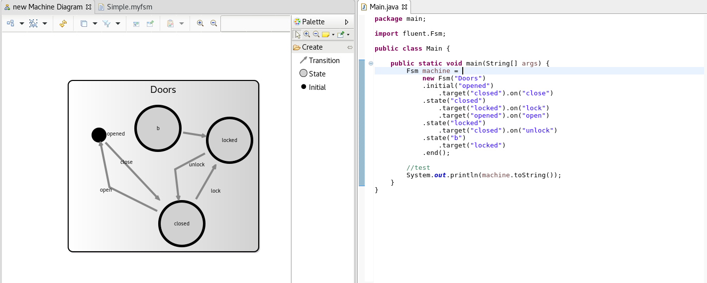

POC of the SLEBus
=================

This repo contains :
 - The Bus implementation
 - An example FSM as EMF model & Java fluent API
 - The implementation of Patch production/consomation for EMF & Java FSM 

Setup
-----
 1. Have an Eclipse with EMF & Sirius
 2. Import projects from 'languageWB' in your workspace
 3. Launch new Eclipse instance
 4. Import projects from 'modelingWB' in your new workspace

Play
----
Once you are in the second Eclipse instance

 0. Check your are in the 'Modeling' perspective (needed for Sirius)
 1. Open 'example/representation.aird' (Machine Diagram)
 2. Open 'foo/Main.java'
 3. Now editing one representation should update the other (after a save)

TODO:
 - Connect the Rascal version of the FSM to the bus
 - Clean up the code
 - Remove hard coded stuff -> need a way to config (through extension point?)
 - Some tests :)
