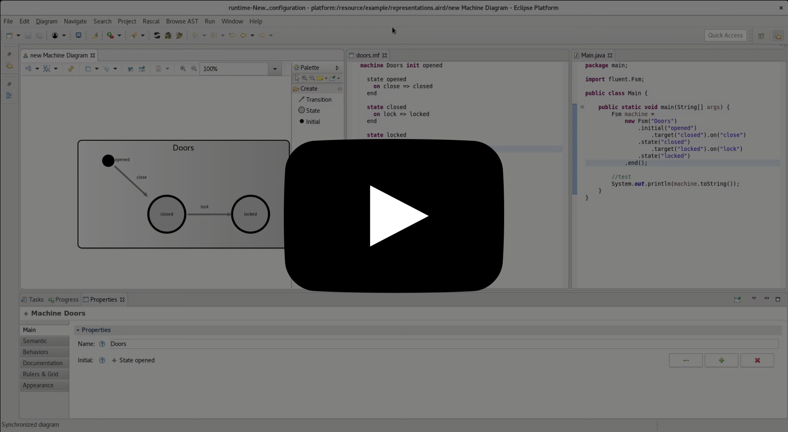

Prism
=====

Prism is a framework to synchronize incarnations of a model shared in different technological spaces.

 

This repository contains
------------------------
 - **The Prism framework**
   * Located in `languageWB\Prism` and `languageWB\Prism.ui`
 - A **Finite State Machine language** implemented in Rascal, EMF and Java fluent API
   * Defined in `languageWB\myfsm.rascal\src\lang.myfsm\MetaModel.rsc`, `languageWB\myfsm.model\model\myfsm.ecore` and `modelingWB\JavaFSM\src\fluent\Fsm.java`
 - Implementations of Patch **producers/consumers** for Rascal, EMF and Java
   * Located in `languageWB/Prism/src/prism/rascal`, `languageWB/Prism/src/prism/emf` and `languageWB/Prism/src/prism/java`

Setup
-----

0. Clone this repository on your machine (command `git clone https://github.com/fcoulon/prism.git` in a terminal) or [download](https://github.com/fcoulon/prism/archive/master.zip) and unzip it.
1. Install Eclipse IDE for Java and DSL Developers [available here](http://www.eclipse.org/downloads/eclipse-packages/)
2. Install Sirius in menu `Help` > `Install New Software...`, copy/past `http://download.eclipse.org/sirius/updates/releases/5.1.0/oxygen` in the `Work with` field, then type the `Enter` key. Check `Sirius` and click `Finish` to start the installation
3. Install Rascal following the same procedure as `Sirius` with `https://update.rascal-mpl.org/stable/` for the `Work with` field
4. Import projects from the repositorty located in `languageWB`. It can be done in menu `File` > `Import...` > `Existing Projects in Workspace`
5. Launch new Eclipse instance. It can be done in menu `Run` > `Run Configurations...` then create `Eclipse Application` and click the button `Run`
6. Import projects from `modelingWB` in your new workspace

Play
----
Once you are in the second Eclipse instance

 0. Check your are in the `Modeling` perspective (needed for Sirius)
 1. Open `example/representation.aird` (Machine Diagram)
 2. Open `JavaFSM/src/main/Main.java`
 3. Open `TestIt/doors.mf` (should not be opened first for technical reason)
 4. Now editing one representation should update the others (after a save)

